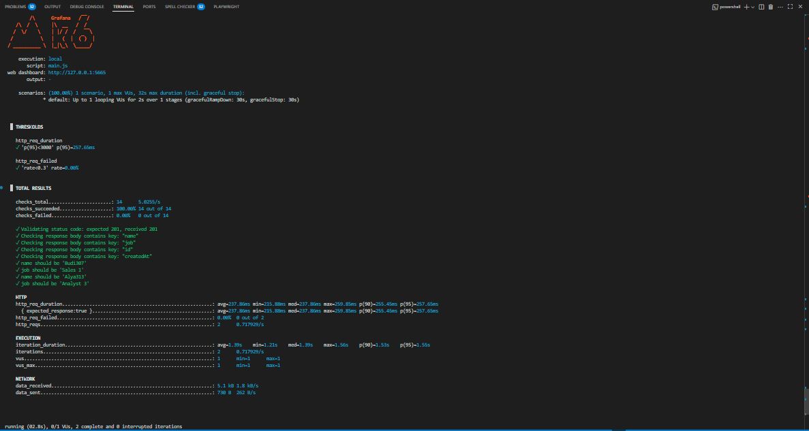
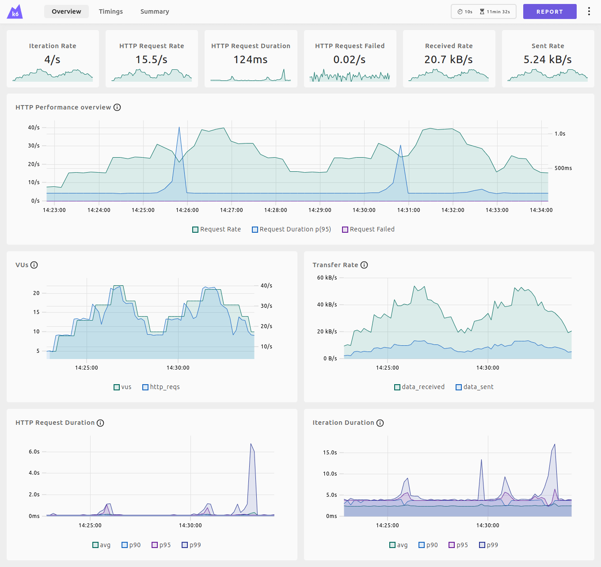

# 🚀 K6 Performance API Testing

## 📖 About This Project
This project is a complete and modular API performance testing suite built using [K6](https://k6.io/), a modern open-source load testing tool designed for developers, QA engineers, and SREs.

K6 allows you to test the performance, reliability, and scalability of your APIs with a developer-friendly scripting approach using JavaScript.

In this project, we’ve implemented various performance testing methods including:

- 🔥 **Smoke Testing** – Quick check to verify if the system is stable
- 📈 **Load Testing** – Test system behavior under expected traffic
- 🌪️ **Stress Testing** – Push the system beyond its limits
- 📊 **Spike Testing** – Sudden traffic increase to test resilience

In addition, this test suite supports:

- ✅ **Custom validations** for status codes, keys, and response values
- ⚙️ **Flexible scenario control**, allowing you to enable/disable specific scenarios easily
- 📏 **Custom metrics** to measure response time, check success rate, response size, and more

This setup is ideal for teams who want to run repeatable, readable, and scalable performance tests, and optionally connect it to monitoring tools like InfluxDB and Grafana for real-time dashboards.

## 🚀 Getting Started

Follow these steps to set up and run the performance tests locally or integrate them into your CI/CD pipeline.

### 1️⃣ Prerequisites

Make sure you have the following installed:

- ✅ [K6](https://k6.io/docs/getting-started/installation/)
- ✅ Node.js (only if you want to generate test data dynamically)
- ✅ [Grafana](https://grafana.com/) if you're using dashboards to manage your report

---

### 2️⃣ Clone This Repository

```bash
git clone https://github.com/your-username/k6-performance-tests.git
cd k6-projects
```

### 3️⃣ Configure Test Scenarios
This project allows flexible configuration for different performance scenarios, stages, validations, and thresholds.

#### 🧩 Enable/Disable Scenarios (`main.js`)
You can enable or disable scenarios directly in `main.js` by editing the `scenarios` section:

```js
export default function () {
  // scenario.registerSuccessfull();
  // scenario.registerUnsuccessfull();
  // scenario.loginSuccessfull();
  // scenario.loginUnsuccessfull();
  scenario.createUser();
  sleep(1);
}
```

#### ⏱️ Set Stages and Thresholds (`utils/scenario.js`)

Stages control traffic patterns. Thresholds define performance expectations.

```js
const stagesMap = {
  load: [
    { duration: "5s", target: 10 },
    { duration: "5s", target: 10 },
    { duration: "2s", target: 0 },
  ]
}

const thresholdsMap = {
  load: {
    http_req_duration: ["p(95)<900"],
    http_req_failed: ["rate<0.2"],
  }
};
```

#### ✅ Set Validation Checks (`utils/check.js`)
Define custom response validations like status codes and body content:

```js
import { check } from "k6";

export function checkResponse(response, expectedStatus) {
  const isStatusValid = response.status === expectedStatus;

  const message = `Validating status code: expected ${expectedStatus}, received ${response.status}\n`;
  check(response, {
    [message]: () => isStatusValid,
  });
}
```

#### ➕ Add New Scenario (`exec.js`)
Each scenario has its own function. You can define them like this:

```js
export function createUser() {
  const { name, job } = generateRandomUser();
  const url = `${config.baseURL}/users`;
  const payload = JSON.stringify({
    name: name,
    job: job,
  });

  const headers = {
    "Content-Type": "application/json",
    "x-api-key": config.auth_register.api_key,
  };

  const res = http.post(url, payload, { headers });
  console.log(`status code: ${res.status}`);
  checkResponse(res, 201);
  checkResponseKeys(res, ["name", "job", "id", "createdAt"]);
  checkKeyValue(res, { name, job });
}
```

### 4️⃣ Running the Tests
You can run the tests based on your needs using one of the following options:

#### ▶ Run Without Dashboard (Default: Smoke Test)
To run the default test scenario:

```bash
k6 run main.js
```
If no environment variable is provided, it will default to the smoke test.

#### ▶ Run With Specific Test Environment

```bash
k6 run main.js TEST_ENV=load
```

You can replace the ``TEST_ENV`` value with ``load``, ``stress``, ``smoke``, ``spike``, or any other scenario you need.

### 5️⃣ Sample Output

Here's what you can expect when running the tests:

#### 🖥️ Terminal Output (CLI)


#### 🖥️ Web-Dashboard (GUI)


## 📢 Contributing Guidelines
We welcome contributions from developers, testers, and performance engineers! To contribute to this project:

1. 🍴 Fork the repository
2. 📥 Create a new branch (git checkout -b feature/my-feature)
3. ✍️ Add your improvements or new scenarios
4. ✅ Test your changes locally
5. 📤 Submit a pull request with clear description and purpose

Please make sure your code is clean, documented, and follows existing project structure. Feel free to open issues or request discussions.

## 🙌 Thank You!
Thank you for checking out this K6 Performance Testing Project!
We hope it helps you build faster, more reliable, and scalable APIs 🚀

If you find this useful, consider giving the project a ⭐ on GitHub and sharing it with your team.

Happy testing! 💥

